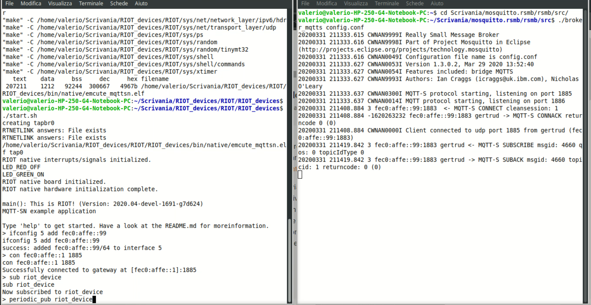

## About
This application represents a virtual environmental station that, periodically, generates random values for:
* temperature (-50... 50 Celsius)
* humidity (0... 100%)
* wind direction (0... 360 degrees)
* wind intensity (0... 100 m/s)
* rain height (0... 50 mm / h)

Each virtual sensor will publish these random values on the MQTT-SN RSMB broker. The script for the sensors are based on emCute module of RIOT-OS, and  generates a JSON payload structured as follow:

        const payload = {
            deviceId: "station",
            temperature: getRndInteger(-50, 50),
            humidity: getRndInteger(0, 100),
            wind_direction: getRndInteger(0, 360),
            wind_intensity: getRndInteger(0, 100),
            rain_height: getRndInteger(0, 50),
            date: parseInt(Date.now()/1000)
        }
        
The date is important for the database and the dashboard that will have to show the last hour values received for every sensor.

## Setup

### Setting up a broker RSMB
First of all, we have to setup the Mosquitto Real Simple Message Broker:

1. Get the RSMB here: https://github.com/eclipse/mosquitto.rsmb
```
git clone https://github.com/eclipse/mosquitto.rsmb.git
```

2. Go into the source folder and build the RSMB
```
cd mosquitto.rsmb/rsmb/src
make
```

3. Create a config file. In this case, we run the RSMB as MQTT and MQTT-SN
   capable broker, using port 1885 for MQTT-SN and 1886 for MQTT and enabling
   IPv6, so save the following to `config.conf`:
```
# add some debug output
trace_output protocol

# listen for MQTT-SN traffic on UDP port 1885
listener 1885 INADDR_ANY mqtts
  ipv6 true

# listen to MQTT connections on tcp port 1886
listener 1886 INADDR_ANY
  ipv6 true
```

4. Start the broker:
```
./broker_mqtts config.conf
```

### Setting up RIOT devices
Before to start the main steps I recommend you to install all the dependencies for RIOT-OS following this guide: https://github.com/RIOT-OS/Tutorials/blob/master/README.md


1. Download RIOT-OS:
```
git clone https://github.com/RIOT-OS/RIOT.git
```

2. Insert our application inside the RIOT folder. You should be able to access this path:
```
---/RIOT-OS/RIOT/RIOT_devices
```

3. Access RIOT folder and setup `tap` and `tapbr` devices using RIOT's `tapsetup` script:
```
sudo ./dist/tools/tapsetup/tapsetup
```

4. Assign a site-global prefix to the `tapbr0` interface (the name could be different on OSX etc):
```
sudo ip a a fec0:affe::1/64 dev tapbr0
```
5. Open a `native` instance:
```
make all term BOARD=native
```

6. Assign a site-global address with the same prefix within the RIOT:
```
ifconfig 5 add fec0:affe::99
```


## Usage
Now we are ready to use our application and sends data to the RSMB broker (you can type `help` to see the available commands).

- To connect to the broker, use the `con` command:
```
con fec0:affe::1 1885
```

- To subscribe to the topic, run `sub` with the topic name as a parameter:
```
sub riot_device
```

- Now to start the periodic sending process, use the `periodic_pub` command followed by the topic name:
```
periodic_pub riot_device
```

### System in action
If everything goes well you have a situation like this:

